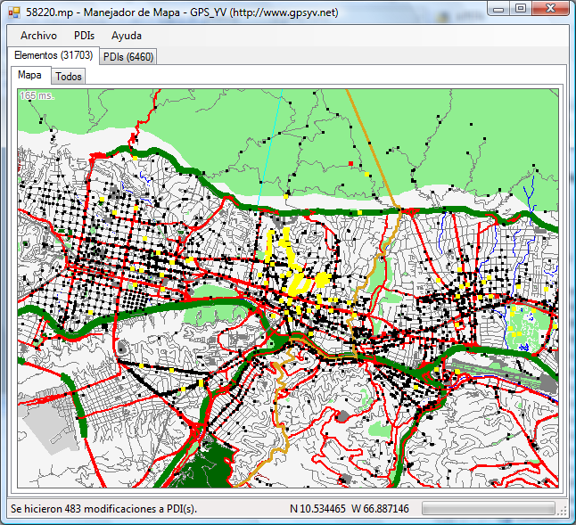
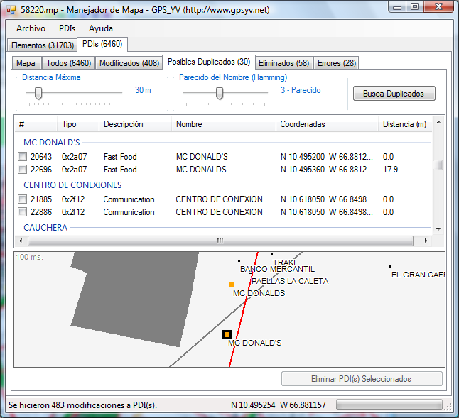

[Español](docs/Home)

**ManejadorDeMapa (GPS Map Manager)** is an application to verify, validate, and fix GPS Maps in **Polish** format (.mp). For now it allows to:
* Eliminate invalid characters in Points of Interests (POIs) names
* Fix letters and words in POI names
* Find and fix duplicated POIs
* Find and fix errors in POIs: unknown types, without coordinates at Level 0, etc.
* Find and fix Roads without standard Route Parameters
* Find and fix errors in Roads: with 1 or 0 coordinates, without coordinates at Level 0, etc.

**ManejadorDeMapa (GPS Map Manager)** is written in C# using the .NET Framework 3.5.

The Polish format is documented in the [cGPSmapper Manual](http://www.cgpsmapper.com/manual.htm).  You can find free maps [here](http://mapcenter.cgpsmapper.com/catalogue.php) and [here](http://garminmapsearch.com/).

This application was born by the need of the GPS Group of Venezuela ([GPS_YV](http://www.gpsyv.net/)) to analyze and fix the maps [GPS_YV generates](http://www.gpsve.net) for the community.  GpsYv.ManejadorDeMapa is distributed under the [GPL](http://www.codeplex.com/GPSYVManejadorDeMapa/license) license with the purpose that it could be useful for other groups or individuals that create maps, and also to promote the collaboration with this project.

If you wish to contribute go to [Configuration for Contributors](Configuration-for-Contributors).

#### Main GUI

#### Duplicate POIs GUI
