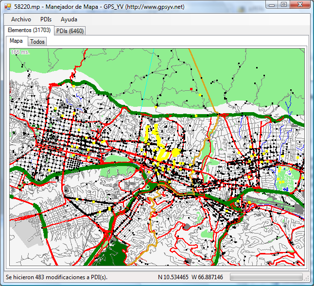
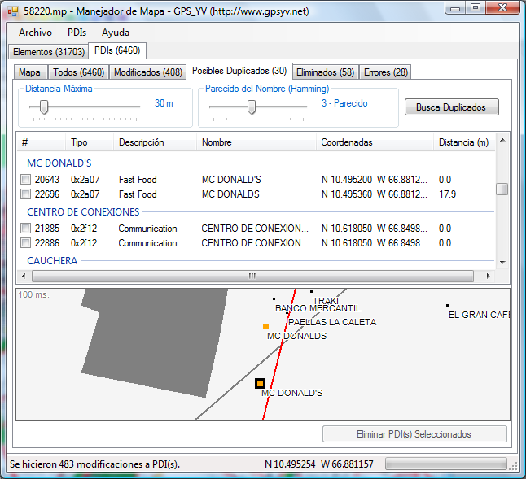

[English](../ReadMe.md)

**ManejadorDeMapa** es una aplicación para validar, verificar, y arreglar Mapas de GPS en el formato **Polish** (.mp).  Por ahora permite:
* Eliminar caracteres inválidos en los nombres de Puntos de Interés (PDIs)
* Corregir letras y palabras en los nombres de PDIs
* Buscar y corregir PDIs duplicados
* Buscar y corregir PDIs con errores: tipos desconocidos, sin coordenadas en el nivel 0, etc.
* Buscar y corregir Vías con Parámetros de Ruta no estándar
* Buscar y corregir Vías con errores: con una o cero coordenadas, sin coordenadas en el nivel 0, etc.

**ManejadorDeMapa** esta escrito en C# usando el .NET Framework 3.5.

El formato Polish está documentado en el [Manual del cGPSmapper](http://www.cgpsmapper.com/manual.htm).  Puedes encontrar mapas gratis [aquí](http://mapcenter.cgpsmapper.com/catalogue.php) y [aquí](http://garminmapsearch.com/).

Esta aplicación nació por la necesidad del Grupo GPS de Venezuela ([GPS_YV](http://www.gpsyv.net/)) de analizar y corregir los mapas que el [GPS_YV genera](http://www.gpsve.net) para la comunidad.  ManejadorDeMapa se distribuye bajo la licencia [GPL](http://www.codeplex.com/GPSYVManejadorDeMapa/license) con la finalidad de que sea útil para otros grupos o individuos que hacen mapas, y también para promover la colaboración con este proyecto.

Si deseas colaborar ve a [Configuración para Colaboradores](Configuración-para-Colaboradores.md).

#### Interfase Principal

#### Interfase de PDIs Duplicados
